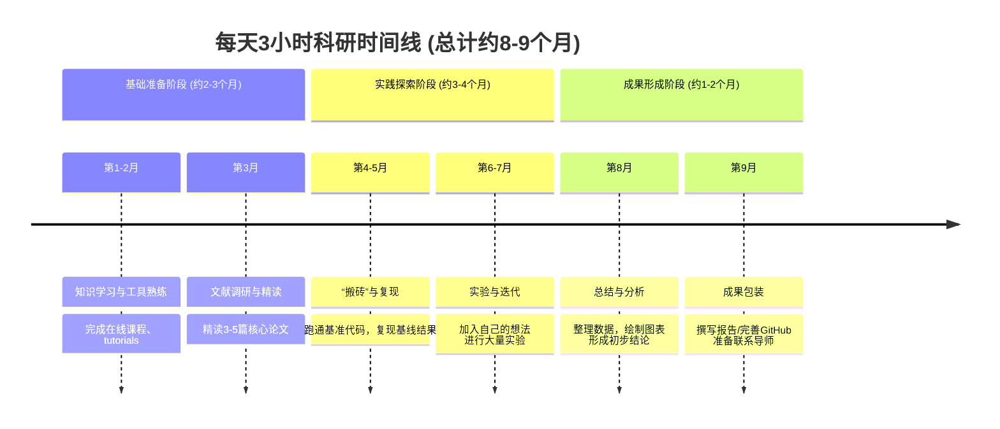

## 科研安排——中大陈川GNN、联邦学习方向

### 一、时间

25年9月——26年3月（寒假争取联系导师）

### 二、安排

#### 1、基础准备阶段

##### 1）9月

主要任务（学习为主）：

- 吴恩达机器学习
- python语法
- 学习科研基础课程

##### 2）10月

主要任务（学习为主）：

- 深度学习
- pytorch、TensorFlow

##### 3）11月

主要任务（文献阅读、积累行业内方法）：

- 机器学习 and 深度学习论文
- 陈川教授代表论文（Web of Science）
- 做好学习笔记

#### 2、实践探索阶段

##### 1）12月——1月15（放假前）

主要任务：

- 每周复现一篇论文
- 行业内的大牛论文（主要是机器学习与深度学习）
- 进组前复现一篇陈川教授的GNN论文
- 做好GitHub仓库管理
- 联系陈教授进组（穷尽方法）
- 确定好研究方向
- 期末考试

##### 2）1月15—2月15（寒假时）

主要任务（进组后）：

- 继续复现陈教授的论文
- 了解联邦学习以及区块链的内容
- 在组里干活
- 根据自己的理解敲定实验方案

#### 3、成果形成阶段

##### 1）2月——3月

主要任务：

- 整理数据、绘制图表、形成初步结论
- 写一篇论文初稿
- 找几个学弟来做一些软著以及专利申请工作

##### 2）3月

主要任务：

- 找邓博、陈教授、汪姐咨询论文投递以及修改建议
- 论文投稿、全力备考研究生考试

##### 3）后期27年1月前

- 论文（争取一篇SCI三区或以上）
- 过初试分数线
- 手头：软著 x 3、实用新型专利 x 1

### 三、资金

- 每月攒下600+ （这样子到26年至少手头要有1w5、其中6k可以用于科研的报班、申请等）
- 或者可以多找几个一起发论文A版面费

